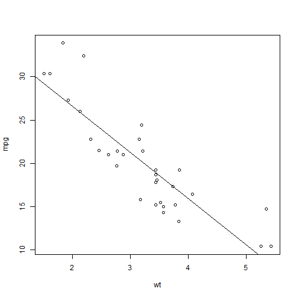

MPG Prediction tool
========================================================
author: Roderick Maclean
date: 6/11/2016

Tool to predict MPG based on the mtcars dataset
========================================================

For more details on authoring R presentations click the
**Help** button on the toolbar.

- mtcars has data on 32 different car models
- Data includes mpg, weight, gearbox type and other data
- Analysis shows that weight is the strongest predictor of mpg
- For simplicity we will just use a linear fit

Example mtcars data used in model
========================================================


```
                   mpg    wt
Mazda RX4         21.0 2.620
Mazda RX4 Wag     21.0 2.875
Datsun 710        22.8 2.320
Hornet 4 Drive    21.4 3.215
Hornet Sportabout 18.7 3.440
Valiant           18.1 3.460
Duster 360        14.3 3.570
Merc 240D         24.4 3.190
Merc 230          22.8 3.150
Merc 280          19.2 3.440
```

Correlation of mpg to weight
========================================================



Model Fit
========================================================


```r
fit<-lm(formula = mpg ~ wt , data = mtcars)

summary(fit)$coef
```

```
             Estimate Std. Error   t value     Pr(>|t|)
(Intercept) 37.285126   1.877627 19.857575 8.241799e-19
wt          -5.344472   0.559101 -9.559044 1.293959e-10
```
